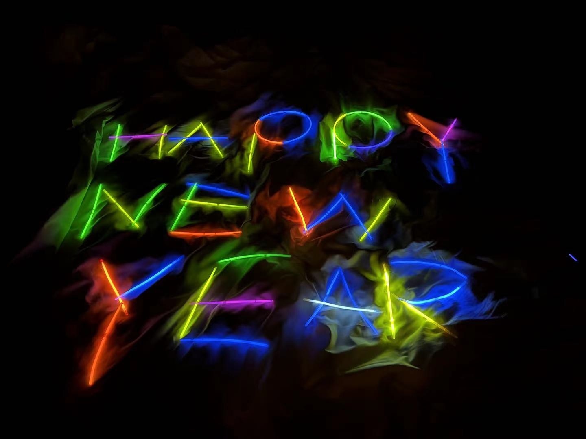
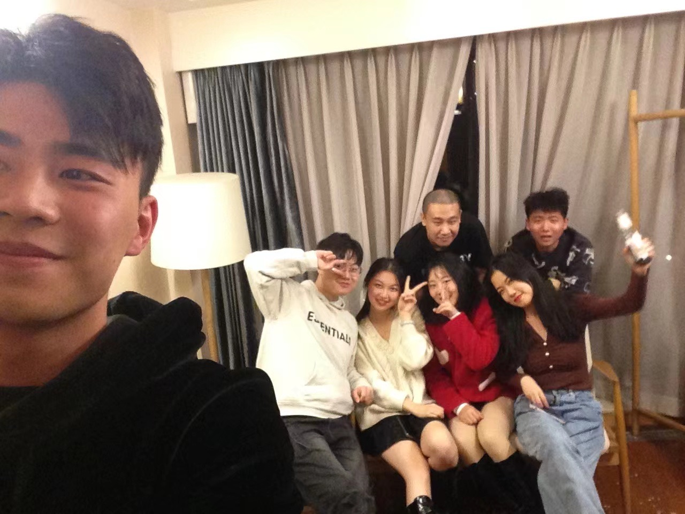
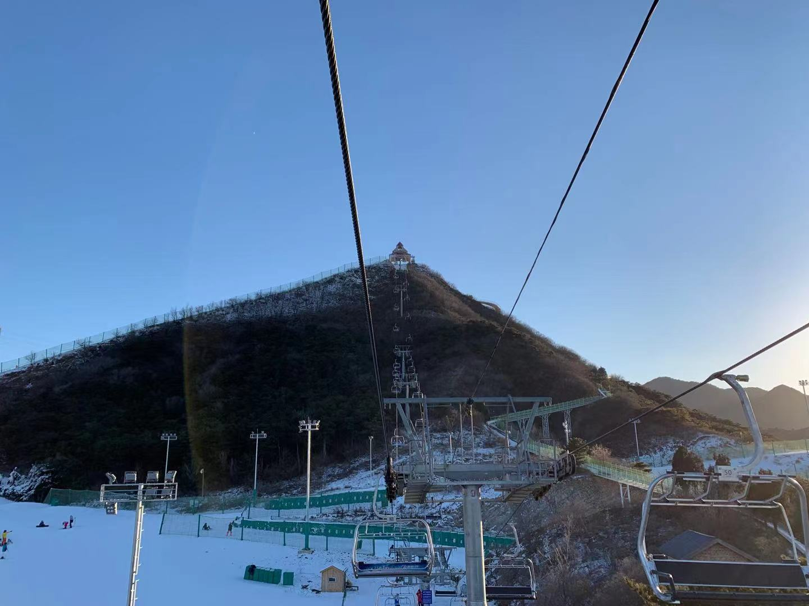

## 关于为什么要写博客
其实没太想明白，暂时定为记录技术遇到的问题和生活。

好像自己看自己写的东西有时候会挺尴尬的，但是有时候又确实想写点什么，其实酝酿一个个站有小半年了，至于为什么到现在才有个雏形，懂得都懂。希望记录下来好过冥想，也可以帮助更好的梳理逻辑，锻炼一下表达能力，毕竟我自己经常看不懂自己写过的技术文档，人的记忆力是有限的，姑且作为我建这个站的一个理由吧。

虽然不能凭爱意将富士山私有，但是遇到优质内容，做做小搬运还是可以的，也可以记下感想。（更新于22年1月初）

最近又想成为一个文人（诗人），可能是闲的，但是写东西需要积累，阅读计划至少要坚持半年才好意思去写点硬的东西。（更新于22年1月9日）

一种通过输出倒逼自己输入的方法（更新于22年1月14日）

## 写在2022的开始
记录一下2021发生的一些事情，琐碎但是又挺有意义的事情还是挺多的。以后慢慢补充，今天先开个坑  

 
 
### 2021的最后一个夜晚
  

### 2021年12月30日滑雪
独自坐缆车上南山顶的高级道，很有感觉，虽然到此刻我的屁股还是疼的  

  

不补充了，太tm蠢了（22年1月14日）
