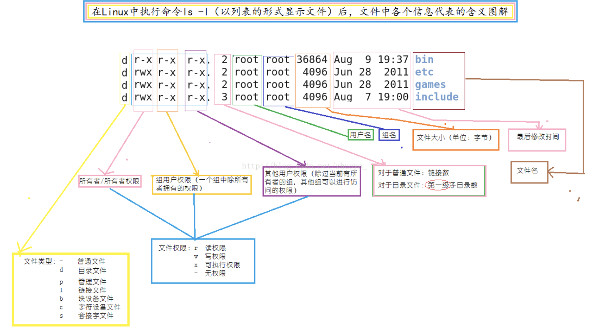

# ls
查看文件信息  
**可选参数**  
```-l```  
 

# du
查看文件夹及子文件大小  
**可选参数**   
```-h``` human-readable  
```-d``` <u>depth</u> diplay all or depth directories  

# stat
输出信息比```ls```命令的输出信息要更详细
包括三个重要时间  
Access time(atime): 是指取用文件的时间   
>常见的操作有：使用vi cat cp或者在这个文件上运用grep sed more less tail head 等命令，凡是读取而不修改文件的操作，都改变文件的Access time. 
 
Modify time(mtime): 修改文件内容的时间  
>只要文件内容有改动或存盘的操作，就会改变文件的Modify time,平常我们使用```ls –l```查看文件时，显示的时间就是Modify time  

Change time(ctime): 文件属性或文件位置改动的时间  
>如使用chmod，chown,mv指令集使用ln做文件的硬连接，就会改变文件的Change time.  

对于Create time，有的可以通过inode方式找到
>Linux的文件能否找到文件的创建时间取决于文件系统类型，在ext4之前的早期文件系统中（ext、ext2、ext3），文件的元数据不会记录文件的创建时间

**可选参数**  
```-x``` （仅mac下使用）类linux的展示方式

# unzip / unar
unzip不支持自定义指定源文件编码格式，而unar支持指定自定义编码格式
> unzip有很多的版本，而适合用在MAC OS上的版本很多不支持指定编码格式。这样就会导致unzip只能使用系统默认编码格式，而windows上压缩时一般采用GBK或者GB2312进行编码，若你的mac的编码格式与zip的不一致则会导致乱码问题。  

**可选参数**  
```-e``` 指定编码方式  
> unar -e GBK xx中文xx.zip

# find
和locate区别  
> locate 命令维护了一份文件和目录的数据库，所以检索速度会快一些，数据库通常一天更新一次，可以手动更新数据库

配合xargs使用 
> Unix 文件系统的文件可以包含空白和新行，这个默认的行为可能造成一些问题，包含空白的文件名可能被 xargs 错误读取。在这个情况下，最好是使用 -0 选项，在使用这个选项之前，同样要保证输出的结果同样是 null 字符分割的字符串，比如 GNU 下 find 命令的 -print0 选项。

**示例**
```find -name "query"   # 搜索文件名，大小写敏感  
find -iname "query"  # 大小写不敏感  
find -not -name "query"  # 查找不包含关键字的文件  
find /tmp -name core -type f -print0 | xargs -0 /bin/rm -f    # name 可以包含空白  type指明类型为f 文件  
find /tmp -depth -name core type f -delete # or not use xargs
```


