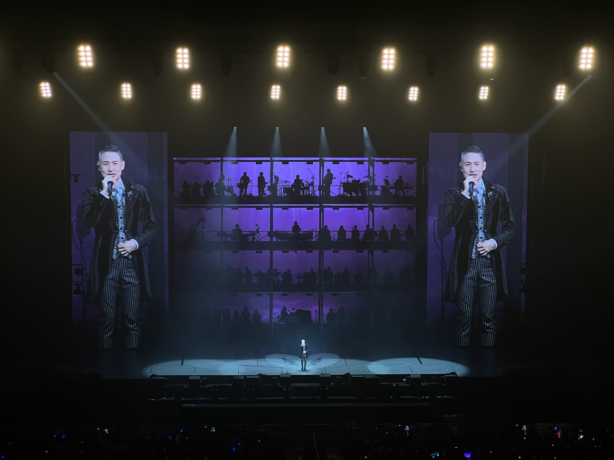

# 2023.11.18
完成了一个计划很久的小目标，带妈妈看了学友的演唱会。  

虽然有一半的歌我好像没听过，不过学友的状态，舞台的氛围，确实让我稍稍有些振奋。  

素闻学友敬业，没想到人还十分活泼，普通话很好，hhh~  

  

# 日出时让街灯安睡
学友有一首《日出时让恋爱终结》，演唱会唱了这首新歌《日出时让街灯安睡》，多么文艺的名字，虽然歌的曲调我没印象，但是歌名我会记得~  

# 人生小目标
发觉计划过并实现的人生小目标好像只有两个  
1.在高中英语老师退休之前看她一次  
2.带妈妈看学友演唱会  

这种性质的事情才能在我这称之为人生小目标，其他的最多是阶段计划，这么看我确实是个好孩子  

# 演唱会
记下演唱会流水账，本以为听不到吻别了，没想到放在了最后一首（“张学友准备开始唱吻别~”来自《听妈妈的话》）    

她来听我的演唱会，你最珍贵  

等你等到我心痛（舒淇出演mv，印象深刻），情书，一千个伤心的理由，分手总要在雨天，又十年，日出时让街灯安睡等等  

在宁波逛了月湖公园，鼓楼，吃了缸鸭狗，蟹粉面  

